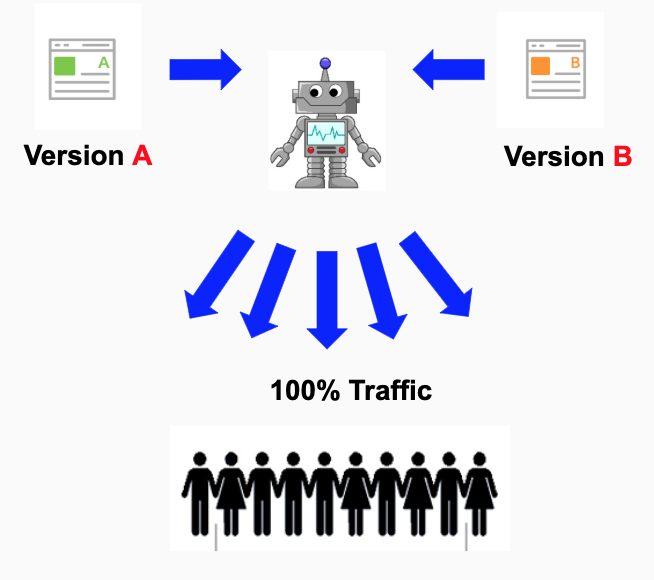

# Practical Artifical Intelligence For A/B Testing
## Apply AI algorithms to leverage the power of A/B testing

A/B testing is a well-known technique applied mainly by designers.
In a web context, when a web page is created, a lot of questions arise about attributes that each element can assume, like colors, fonts, borders, sizes, headers and so on. 
There are a lot of variable that can be combined into a web page that make it outstading performer.

However, it's nearly impossible to test all combination of features to build a web page with a high peformance. In this scenario, many people uses A/B testing to help them decide by all different types of attributes for web elements. The principal pain of the A/B testing is the time that it takes to decide for thebest web page, it can take weeks or month to decide. Also, during the experimentation time, your webpage is losing convertion because you are sending audience to a poor web page as well. A possible solution for this drawback is to quickly figure out which is the web page with the highest performance and gradually send all the audient to convert in the best version of the web page.

Reinformance learning is a possible solution. This repos contains the codes about build a AI Agent to perform a A/B testing using two versions of a web page.

## Traditional A/B Testing
You have researched methods to do it and discovered a technique called A/B testing. This technique says that you should equally split your website traffic for each version of the homepage that you want to test. This division should be made randomly, and after a time span, you need to measure the number of clicks from the tested versions and decide which one is the winner.

## A/B Testing with Artificial Intelligence ( AI ) Agent
The main difference here is the presence of the Agent.
